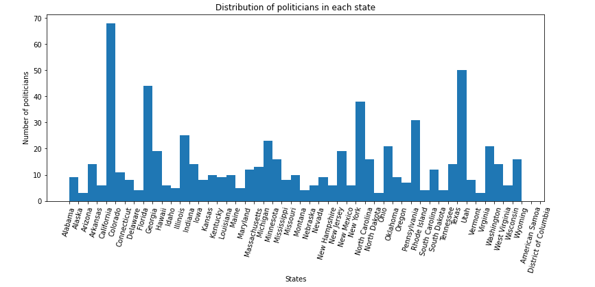
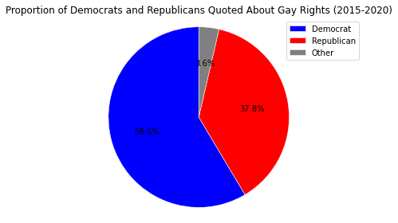
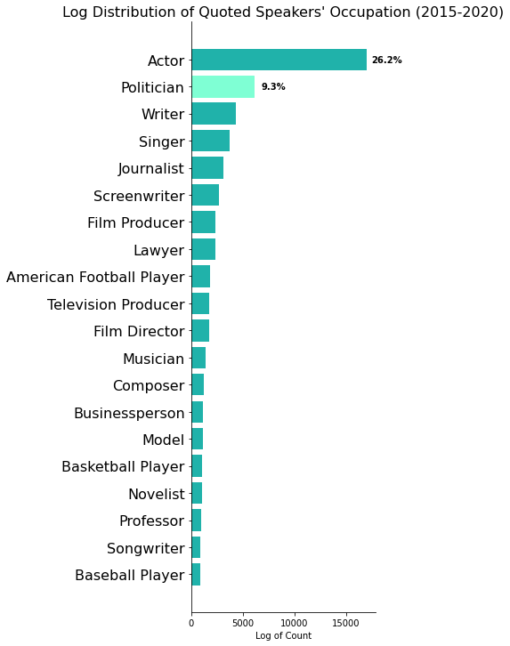
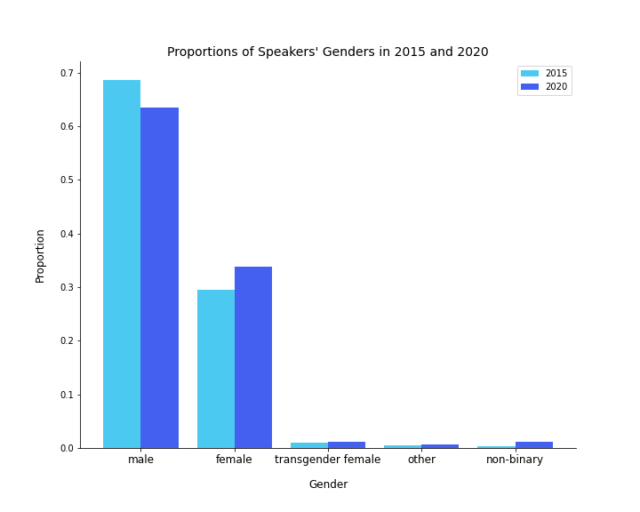
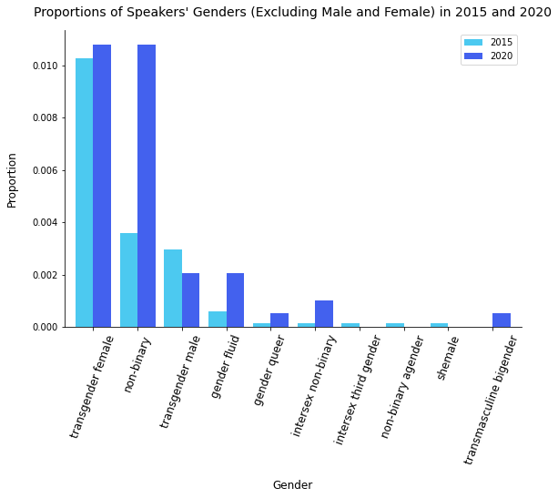
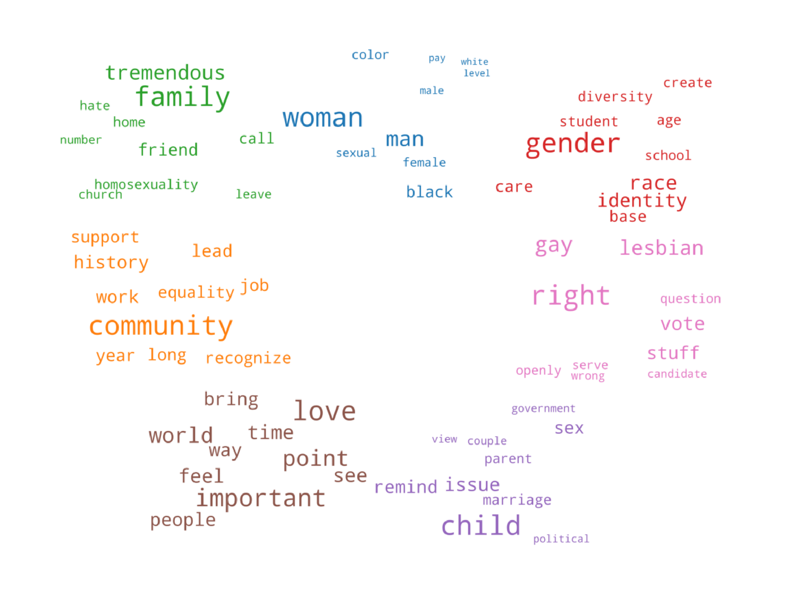
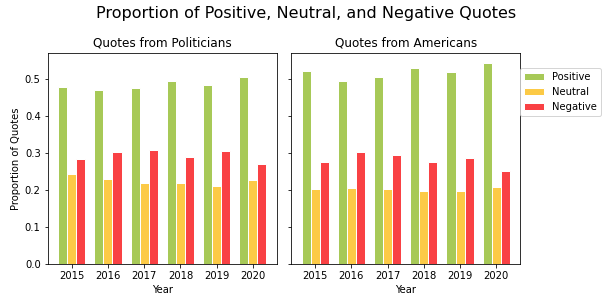
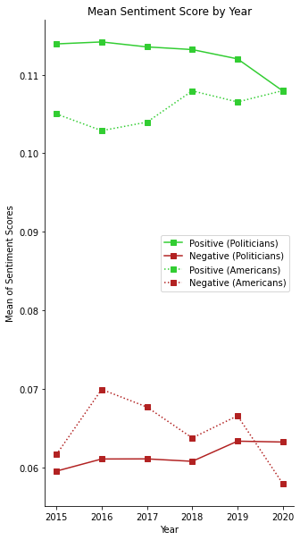

# Why this study?

Over the last few years, we have seen the rise of many movements fighting for **civil rights**, whether it is **anti-racist**, **feminist** or in our case, for **gay rights**. Indeed, it seems that with the **liberation of speech** thanks to **social networks**, everyone can have a voice and not only journalists, politicians or personalities on TV shows, as used to be the case. Therefore, **minorities are finally getting heard,** but are they really becoming more accepted?

This liberation of speech has led to very positive outcomes, encouraging a general open-mindedness on the matter of gay rights. On **June 26, 2015, the U.S Supreme Court legalized same-sex marriage in the fifty states,** what impact did it have on Americans' opinions?

In our data story, we are going to focus on who is speaking about the **LGBTQ+ community**, the evolution of opinions on the subject, and what differences we can see across states in the USA, with a special attention to politicians' statements.   

## Index
1. [Who is speaking about it?](#who)
2. [What are they saying?](#what)
3. [Sentiment Analysis](#sent)
4. [Acceptance across the States](#states)
5. [Conclusion](#conc)

# Who is speaking about it ?
As gay rights is a societal topic, many different types of people talk about it. As we are most interested in **politicians**, let's see what they have to say about it. First, let's look at the distribution of politicians in each state.

  

In order to get an accurate idea of which states' representatives are speaking the most about gay rights, we normalize the quotes from politicians about gay rights with respect to the states' populations. The distributions are similar across all years, so here we can look at 2015 as an example.

  

As we can see **California, New York, Florida and Texas** are the major states speaking about gay rights. For **California** it is not surprising as it is considered to be a very **liberal state** in regard to **LGBTQ+ rights**. Discrimination protections regarding sexual orientation and gender identity were adopted in 2003. In 1999, California was also the first state in the U.S. to **legalize domestic partnerships between same-sex couples**. Same-sex adoption has also been legal statewide since 2003, permitting stepchild adoption and joint adoption between same-sex couples. 

The same goes for **New York**, which is seen as a very **socially liberal** state. Same-sex sexual activity has been legal since **1980**. Same-sex marriage has been legal statewide since 2011. In addition, both conversion therapy on minors and the gay and trans panic defense have been banned since 2019. Also, New York City is now seen as **one of the most LGBTQ-friendly cities in the U.S.**

For **Florida**, it is not a very progressive state as same-sex sexual activity only became legal after the Supreme Court's decision on June 26, 2003. Nevertheless, there are laws to protect against LGBTQ+ discrimination. 

In opposition, **Texas** has always been a very **conservative state** and LGBTQ+ people face legal and social challenges and discriminations. There is no statewide law banning anti-LGBTQ+ discrimination. Same-sex marriage is legal since 2015, but only as a result of the federal law. Here we can see which political parties are more vocal on the topic. There are a roughly equal number of Democrats and Republicans in the Senate and Congress, so we can easily compare their contributions.

First, let's see the partition of **Democrat/Republican** speakers:

  

**Democrats**, who tend to support LGBTQ+ rights, speak more on the subject than **Republicans.** 

But politicians are not the only part of the debate. Indeed, lots of other personalities speak on gay rights. Let's look at their different occupations:

  

As we can see, **actors** play a very important role, the politicians are quite far behind! One might find it surprising that **politicians represent 9.3%** while **actors represent 26.2%**. Politicians are the ones who can enact laws and create change, in both directions, depending on the opinion. But at the same time, actors have lots of **influence** because of their exposition and are often quoted in the media in case of a **coming out** or an opinion. Also, they often play the role of an LGBTQ+ person. 

Finally, when analyzing the coverage of a minority's rights, it is interesting to look at the **gender of the speakers**, as in the U.S, **white males are often over-represented** and tend to have more space and time to express their opinions, whereas other minorities, including the concerned ones, are less heard. 

  

  
As expected, **males represent almost 70% of the speakers**. We can see a small increase in female speakers between 2015 and 2020. The distribution without males and females represented allows us to visualize minorities that are otherwise completely overshadowed.
  
  

  

 On this new scale, transgender females are very present as well as non-binary people. We see a notable increase in quotes from **non-binary** and **gender fluid** people from 2015 to 2020. This might suggest that the terms 'non-binary' and 'gender fluid' have become more normalized and more commonly used by journalists, or perhaps there has been a growth in the populations of people idenitfying that way. 

It is important to note that the differences in proportions among genders are partly due to the differences in population sizes. The amount of transgender females is estimated to be about double the amount of transgender males in the U.S., so the idea is not to compare the proportions between groups here. We are more interested in the evolution from 2015 to 2020. As we have seen, many different people with different opinions talk about LGBTQ+ rights. We have to look at the content of the quotes for a deeper analysis of the related ideas.

# What are they saying ?

Over all our data, we modelled the different topics discussed to examine **the major concerns and debates around the LGBTQ+ community.** In order to obtain these topics, we used an unsupervised topic modeling algorithm called Latent Dirichlet Allocation. Given a number of topics to detect, this algorithm provides us with collections of words that can be interpreted as topics. We found that the best results revealed **7 distinct topics**.

- The first one, in **blue**, represents the different sorts of **discrimination: by race, gender and sexual orientation.** The term **'pay'** comes up, as lots of studies have shown that there is a gap between mens' and womens' salaries, as well as between black people and white people, and gay and heterosexual people. A study has shown that the gender pay gap is also present among gay people:  according to the Williams Institute, **women in same-sex couples have a median personal income of $38,000** compared to **$47,000 for men in same-sex couples**. Indeed, the different sorts of discrimination tend to cross over, it is called **intersectionality.** It explains why the other kinds of discriminations are also present in our data as it is all very linked together.

- The **red** topic is centered on **diversity in schools**. There have been lots of stories of LGBTQ+ teenagers that **don't feel safe or accepted in their schools.** For example, some teachers still call transgender students by their dead names or wrong pronouns. It has brought up the debate of tolerance and acceptance in schools and universities. 

- For the **purple** topic, it concerns **same sex couples having children** with the words: **'child', 'parent', 'marriage', 'couple', 'political'.** As we have seen before, it has been a difficult fight in order to obtain the legal right to adopt for same-sex couples in 2017.

- In **pink**, it is concentrated around **politics** with words like **'vote', 'candidate', 'right'.** A right is never earned and it is important to stay vigilant, as new movements or governments can be threatening to LGBTQ+ rights or more generally, to any minority rights. The election of Trump in 2016 demonstrates this. Therefore, voting and electing tolerant candidates is crucial, especially for this community.

- The **brown** topic is about **love** with words like **'feel', 'love', 'people'.** It's all about love at the beginning!

- The **orange** topic has words like **'equality', 'community', 'history' or 'recognize'.** It demonstrates the willingness to **recognize and acknowledge the history of the LGBTQ+ movement for liberation and equality.** 

- The **green** one is focused on **family, religion and acceptance**, with words **'church', 'family', 'leave', 'home'**. **Coming out** can be a very complicated moment as some families are not accepting, often due to **religion**, and LGBTQ+ people are sometimes forced to leave their homes. It is a terrible but true statement that **640 thousands of LGBTQ+ youth are homeless.**

Now let's look at the **evolution** of the topics **from 2015 to 2019**.

The topic modelling from 2015 reveals that **marriage** is a topic that was very frequent. It was associated with **right, discrimination, equality.** Indeed, **gay marriage was legalized in the 50 states on June 26, 2015.** The matter was the focus of speculation for months. **Barack Obama**, president at the time,  praised the Supreme Court's ruling. Before this decision, there occurred a very stormy debate, with multiple states banning it, but also several states that legalized it and then re-banned it a few years later. Even Barack Obama did not have a very clear position on it and made several declarations in both directions. 

Let's see how the topics evolved in 2019.

In 2019, a topic stands out which contains the words **child, parent, and sexuality**. It is a really interesting bag of words as it points out various subjects that emerged through the years. After the legalization of marriage, a key subject was **child adoption.** Until 2017, laws related to LGBTQ+ couples adopting children varied by state. Some states granted full adoption rights to same-sex couples, while others banned same-sex adoption or only allowed one partner in a same-sex relationship to adopt the biological child of the other. But, **on June 26, 2017, the U.S Supreme Court made adoption by same-sex couples legal in all 50 states.** Attitudes toward same-sex parenting have improved as the number of same-sex couples and same-sex parenting overall has increased in the U.S.

There have also been lots of debates with the increasing number of **films or TV shows involving LGBTQ+ people**. If they are seen as a major step towards acceptance and greater representation, some conservative movements claim that they are not appropriate, particularly for children. In 2019, major LGBTQ+ movies came out, such as BPM (Beats per Minute) or Call Me By Your Name. 

To conclude, what really made the difference for the evolution of gay rights was not solely the work of the lawyers and plaintiffs who brought the case but really the **decades of activism** that normalized the idea of gay marriage. This demonstrates **the impact Americans had on the evolution of the law**. It is therefore very interesting to look at statements from all Americans. We performed a sentiment analysis of their statements and compared it with politicians. 

# Sentiment Analysis
From what we have seen so far, it is obvious that we are speaking more about the LGBTQ+ topic today than in 2015, but does it necessarily mean the **LGBTQ+ community is more accepted?**

  

The sentiment analysis we performed revealed that the proportion of positive, negative, and neutral quotations remained pretty constant these last few years with a positive sentence proportion that takes over the negative and neutral quotations. Despite this, the proportion of **negative quotations remains very high**. This analysis doesn’t show major improvements in the quote sentiments which is **worrying.**

We can distinguish the politicians’ sentiments from the overall population of the US and visualize the evolution of positive and negative sentiment scores.

  
  

  
Indeed, looking at the **politicians'** statements we notice an **increasing positive sentiment score from 2015 to 2018**, then this value starts to decrease, while the **negative sentiment score begins to increase**. 
On the other hand we can observe the **positive sentiment score for Americans'** statements is **increasing**, while the negative sentiment score is decreasing.

### Are these results significant?
Due to the distribution of the data, it is difficult to perform a hypothesis test in order to conclude whether these differences in sentiments are statistically significant. The **Wilcoxon rank-sum test** can give us an idea of how to interpret the evolution of sentiments for each group. It is a nonparametric test of the null hypothesis that for randomly selected values X and Y from two populations, the probability of X being greater than Y is equal to the probability of Y being greater than X. 

First of all, we performed the test on the compound sentiment scores for politicians, comparing 2015 and 2020. This gave a p-value of **0.051539**. Then, we looked at the compound sentiment scores for all Americans, once again comparing 2015 and 2020. This gave a p-value of **0.00055**.  From these results, we can reject the null hypothesis and conclude that there is a statistcally significant change in sentiment from 2015 to 2020 for all Americans. However, we cannot draw a concrete conclusion about the change in sentiment of politicians.

One more time we can see that **progress is unstable**, nothing is certain, getting rights is a constant fight and laws can go backwards at any time.

# Acceptance across the States 

As we have seen so far, the U.S. has enacted some important laws toward **equality for LGBTQ+**, with the **gay marriage** and **child adoption** laws. Nevertheless, the community still faces various forms of **discriminations and violence** across the country. We wanted to have a look and compare each state to see where the LGBTQ+ community is most accepted.

First, let's see how the distribution of **hate crimes due to sexual orientation** in all the states has evolved from 2015 to 2019.

Most of the states have a very small percentage (with respect to their population size) with less than 0.002% of cases. But some states stand out with high peaks. Especially in the **District of Columbia** which has tremendously high numbers. From **2015 to 2019** it doubled in proportion, **going from 0.012% to more then 0.025%**. **Washington** has also registered an **increase, going from 0.014 to 0.0025%.** In **Vermont**, it went **from 0.001 to 0.004%**. Overall, the number of assaults stayed mostly constant with minor rises or falls in some states from 2015 to 2019. 

Nevertheless, we collected our data from the **FBI** website, but it is likely **dramatically underestimated** because of **flaws in the current data collection process** and **massive discrepancies with the much larger number of self-reported incidents**. The real number of hate crimes over the states could be much greater.

Finally, we collected data on the LGBTQ+ population for each state to see where it is the most prevalent.

This graph reveals a very interesting element: **District of Columbia** has the **highest LGBTQ+ density** and is also the state with the **highest number of hate crimes related to sexual orientation**. We would expect that where the LGBTQ+ community is the most present, it would be in very progressive states and that the hate crimes would not be so widespread. But the graphs show the opposite. This might be due to very **conservative and homophobic movements** in reaction to this "high" density of LGBTQ+ people. It is very alarming especially for D.C. 

# Conclusion

From our analysis, we have seen that there are **lots of different speakers** on the **LGBTQ+ rights** topic. First of all, people who talk about it the most are not the people concerned but rather the **dominant classes**. **Politicians** are major speakers as they make laws in order to extend or reduce the rights of this community. But, as it is a **societal matter**, public opinion is a key component of the debate. Where politicians tend to stand in retreat and be less committed, **activist and actors** take **strong positions**. We know that **culture**, through **movies, books, or TV shows** allow Americans to **open their minds and accept each other.** Indeed, our sentiment analysis revealed that Americans' sentiments are getting slightly more positive over the years. 

However, it can still evolve in one direction or another. **Conservative movements** have lots of **power** in America. Some progressive laws have already been cancelled in the past, as we have seen with gay marriage in several states. 

Regarding the **hate crimes**, it confirms that the LGBTQ+ community is not fully accepted and suffers from very **violent assaults and discriminations**. The **protection** of the community needs to be reformed as it is **nonexistent** in some states. 

In conclusion, there has been an unquestionable **liberation of speech** these last few years that have allowed more voices to be heard. We may think that this implies major improvements in gay rights and acceptance but there is still a lot of work to do to reach **equality**. 

**We have got to keep fighting!**

# References

<a href="#top">Back to top</a>

Hate Crimes in D.C. - D.C. Policy Center | www.dcpolicycenter.org

LGBT+ Rights and Peace in Colombia: The Paradox Between Law and Practice | www.wola.org

Colombia failing to stem murders of LGBT people | Reuters | www.reuters.com

How Gay Marriage Won in the U.S. Supreme Court - The Atlantic | www.theatlantic.com

Equal pay is an LGBT issue - National LGBTQ Task Force | www.thetaskforce.org

The Cost of Coming Out: LGBT Youth Homelessness | Lesley University | www.lesley.edu

Anti-gay hate crimes on the rise, FBI says, and they likely undercount | www.eu.usatoday.com

A Contentious Debate: Same-Sex Marriage in the U.S. | Pew Research Center | www.pewforum.org

