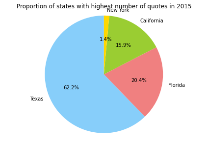
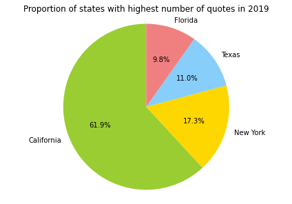

# Why this study?

Over the last few years, we have seen the rise of many movements fighting for **civil rights**, whether it is **anti-racist**, **feminist** or in our case, for **gay rights**. Indeed, it seems that with the **liberation of speech** thanks to **social networks**, everyone can have a voice and not only journalists, politicians or personalities on TV shows, as it used to be the case. Therefore, **minorities are finally getting heard,** but are they really getting more accepted?

This has led to very positive outcomes, with a general open-mindedness on the matter of gay rights. On **June 26, 2015, the U.S Supreme Court legalized same-sex marriage in the fifty states,** what impact did it have on the American opinions?

In our data story, we are going to focus on who is speaking about the **LGBTQ+ community**, the evolution of opinions on the subject, and what differences we can see across states in the USA, with a special attention to politicians' statements.   

# Who talks about it ?
As it is a societal topic, many different people talk about it. As we are most interested in **politicians**, let's see what they have to say about it. First, let's see the distribution of senators in each state.

We will focus on the 4 major states and see how it evolves from 2015 to 2019.

2015                                                                | 2019
:---------------------------------------------------------------------:|:--------------------------------------------------------------------------------------:
              |  

As we can see **California, New York, Florida and Texas** are the major states who talk about it. For **California** it is not surprising as it is considered to be a very **liberal state** in regard to **LGBTQ+ rights**. Discrimination protections regarding sexual orientation and gender identity were adopted in **2003**. In 1999, California was also the first state in the U.S. to **legalize domestic partnerships between same-sex couples**. Same-sex adoption has also been legal statewide since 2003, permitting stepchild adoption and joint adoption between same-sex couples. 

The same goes for **New York**, which is seen as a very **socially liberal** state. Same-sex sexual activity has been legal since **1980**. Same-sex marriage has been legal statewide since 2011. In addition, both conversion therapy on minors and the gay and trans panic defense have been banned since 2019. Also, New York City is now seen as **one of the most LGBTQ-friendly cities in the U.S.**

For **Florida**, it is not a very progressive state as same-sex sexual activity became legal after Supreme Court's decision on June 26, 2003. Nevertheless, there are laws to protect against LGBTQ+ discrimination. 

In opposition, **Texas** has always been a very **conservative state** and LGBTQ+ people face legal and social challenges and discriminations. There is no statewide law banning anti-LGBTQ+ discrimination. Nevertheless, same-sex marriage is legal since 2015 under the federal law. We will see how the political party impacts the number of quotations for a state and what ideas are related in the statements.

First, let's see the partition of **Democrat/Republican** speakers:

**Democrats**, who tend to support LGBTQ+ rights, talk more on the subject than **Republicans.** 

But politicians are not the only part of the debate. Indeed, lots of other personalities speak on gay rights. Let's look at their different occupations:

As we can see, **actors** play a very important role, the politicians are quite far behind! One might find it surprising that **politicians represent 9.1%** while **actors represent 23.3%**. Politicians are the ones who can apply laws and create change, in both directions, depending on the opinion. But at the same time, actors have lots of **influence** because of their exposition and are often quoted in the media in case of a **coming out** or an opinion. Also, they often play the role of an LGBTQ+ person. 

Finally, when analyzing the coverage of a minority's rights, it is interesting to look at the **gender of the speakers** as in the U.S, **white males are often over-represented** and tend to have more space and time to express their opinions, whereas other minorities, including the concerned ones, are less heard. Let's see if it the case here:

2015                                                                          | 2019
:----------------------------------------------------------------------------:|:--------------------------------------------------------------------------:
                                 |  
                           |

As expected, **males represent almost 75% of the speakers**. We can see a small increase of women speakers between 2015 and 2019. The distribution without male and women represented allows us to visualize minorities that are otherwise completely overshadowed by men and women. On this new scale, transgender female are very present as well as non-binary people. 
It is interesting to note that a **majority of the quotes** are from **male speakers**. It really shows that LGBTQ+ people are still not as represented as they should be, even on the topics of their own rights.

As we have seen, many different people with different opinions talk about the LGBTQ+ rights but what is sure so far is that powerful men dominate the statements and the LGBTQ+ community itself is largely under-represented. We have to look at the content of the quotes for a deeper analysis of the related ideas.

# What are they saying ?

Over all our data, we modelled the different topics discussed in all the quotes to see what are **the major concerns and debates around the LGBTQ+ community.** This analysis revealed **7 distinct topics**.

- The first one, in **blue**, represents the different sorts of **discrimination: by race, gender and sexual orientation.** The term **'pay'** comes up, as lots of studies have shown that there is a gap between mens' and womens' salaries, as well as between black people and white people, and gay and heterosexual people. A study has shown that the gender pay gap is also present among gay people:  according to the Williams Institute, **women in same-sex couples have a median personal income of $38,000** compared to **$47,000 for men in same-sex couples**. Indeed, the different sorts of discrimination tend to cross over, it is called **intersectionality.** It explains why the other kinds of discriminations are also present in our data as it is all very linked together.

- The **red** topic is centered on **diversity in schools**. There have been lots of stories of LGBTQ+ teenagers that **don't feel safe or accepted in their schools.** For example, some transgender students are still called by their teacher by their dead names or wrong pronouns. It has brought up the debate of tolerance and acceptance in schools and universities. 

- For the **purple** topic, it concerns **same sex couples having children** with the words: **'child', 'parent', 'marriage', 'couple', 'political'.** As we have seen before, it has been a difficult fight in order to obtain the legal right to adopt for same-sex couples in 2017.

- In **pink**, it is concentrated around **politics** with words like **'vote', 'candidate', 'right'.** A right is never earned and it is important to stay vigilant as new movements or governments can be threatening to LGBTQ+ rights or even more largely, to any minority rights. The election of Trump in 2016 demonstrates this. Therefore, voting and electing tolerant candidates is crucial especially for this community.

- The **brown** topic is about **love** with words like **'feel', 'love', 'people'.** It's all about love at the beginning!

- The **yellow** topic has words like **'equality', 'community', 'history' or 'recognize'.** It demonstrates the willingness to **recognize and acknowledge the history of LGBTQ+ movement for liberation and equality.** 

- The **green** one is focused on **family, religion and acceptance**, with words **'church', 'family', 'leave', 'home'**. **Coming out** can be a very complicated moment as some families don't accept it, often under cover of **religion** and LGBTQ+ people are sometimes forced to leave their homes. It is a terrible but true statement that **640 thousands of LGBTQ+ youth are homeless.**

Now let's look at the **evolution** of the topics **from 2015 to 2019**

The topic modelling from 2015 reveals that **marriage** is a topic that was very frequent. It was associated with **right, discrimination, equality.** Indeed, the **gay marriage was legalized in the 50 states on June 26, 2015 ruled by the Supreme Court.** The matter was the focus of speculation for months. **Barack Obama**, president at the time,  praised the Supreme Court's ruling. Before this decision, there occurred a very stormy debate, with multiple states banning it, but also several states that legalized it and then re-banned it few years later. Even Barack Obama did not have a very clear position on it and made several declaration in both directions. 

Let's see how the topics evolved in 2019.

In 2019, a topic stands out which contains the words **child, parent, and sexuality**. It is a really interesting bag of words as it points out various subjects that emerged through the years. After the legalization of marriage, a key subject was **child adoption.** Until 2017, laws related to LGBTQ+ couples adopting children varied by state. Some states granted full adoption rights to same-sex couples, while others banned same-sex adoption or only allowed one partner in a same-sex relationship to adopt the biological child of the other. But, **on June 26, 2017, the U.S Supreme Court made adoption by same-sex couples legal in all 50 states.** Attitudes toward same-sex parenting have improved as the number of same-sex couples and same-sex parenting overall has increased in the U.S.

There have also been lots of debate with the increasing number of **film or TV shows involving LGBTQ+ people** in it. If it is seen as a major progress to acceptance and more representations, some conservative movements claim that it is not appropriate for children especially. In 2019, major LGBTQ+ movies came out, such as BPM (beats per minutes) or Call Me By Your Name. 

To conclude, what really made the difference for the evolution of gay rights was not solely the work of the lawyers and plaintiffs who brought the case but really the **decades of activism** that normalized the idea of gay marriage. This demonstrates **the impact Americans had on the evolution of the law**. It is therefore very interesting to look at statements from all Americans. We performed a sentimental analysis of their statements and compared it with politicians. 

# Sentiment Analysis
From what we have seen so far, it is obvious that we are speaking more about the LGBTQ+ topic today than in 2015. In fact, the number of quotations on Quotebank related to the topic went from **844 in 2015** to **73088 in 2019** which means **multiplying the speeches about the gay rights by 86**, but does it necessarily mean the **LGBTQ+ community is more accepted?**

  

The sentiment analysis we performed revealed that the proportion of positive, negative, and neutral sentences remained pretty constant these last few years with a positive sentence proportion that takes over the negative and neutral sentences although the **negative sentences remain very high**. This analysis doesn’t show major improvements in the quotes sentiment which is **worrying.**

We can distinguish the politicians’ statements from the overall population of the US.

  
  

  
Indeed, looking at the **politicians** statements we notice an **increasing proportion of positive sentences from 2015 to 2018**, then this proportion started to decrease in contrast to the **negative proportion that is dangerously increasing** still today. 
On the other hand we can observe the proportion of **positive sentences in Americans** statements is **increasing** and taking over the negative proportion that decreases.

One more time we can see that **progress is unstable**, nothing is certain, getting rights is a constant fight and laws can go backwards at any time.

# Acceptance across the States 

As we have seen so far, the U.S. has enacted some important laws toward **equality for LGBTQ+**, with the **gay marriage** and **child adoption** laws. Nevertheless, the community still faces lots and various forms of **discriminations and violence** all over the states. We wanted to have a look and compare each state to see where it is the most accepted and equally-treated and where it is the worst.

First, let's see how the distribution of **hate crimes due to sexual orientation** in all the states has evolved in 2015 and 2019.

Most of the states have very small percentage (with respect to their population size) with less than 0.002% of cases. But some states stand out with high peaks. Especially in the **Distric of Columbia** which have tremendously high numbers. From **2015 to 2019** it doubled in proportion, **going from 0.012% to more then 0.025%**. **Washington** has also registered an **increase, going from 0.014 to 0.0025%.** In **Vermont**, it went **from 0.001 to 0.004%**. Overall, the number of assaults stayed mostly constant with minor rises or falls in some states from 2015 to 2019. 

Nevertheless, we collected our data from the **FBI** website but it is likely **dramatically underestimated** as experts point out, because of given **flaws in the current data collection process** and **massive discrepancies with the much larger number of self-reported incidents**. The real number of hate crimes over the states could be much more important.

Finally, we collected data on LGBTQ+ population for each states to see where it is the most prevalent.

This graphs reveals a very interesting element: **District of Columbia** has the **highest LGBTQ+ density** and is also the State with the **highest number of hate crime related to sexual orientation**. We would expect that where the LGBTQ+ community is the most present, it would be in very progressive states and that the hate crimes would not be so widespread. But the graphs show the opposite. This might be due to very **conservative and homophobic movements** in reaction to this "high" density of LGBTQ+ people. It is very alarming especially for D.C. 

# Conclusion

From our analysis, we have seen that there are **lots of different speakers** on the **LGBTQ+ rights** topic. First of all, people who talk about it the most are not the people concerned but rather the **dominant classes**. **Politicians** are major speakers as they make laws in order to extend or reduce the rights of this community. But, as it is a **societal matter**, public opinion is a key component of the debate. Where politicians tend to stand in retreat and be less committed, **activist and actors** take **strong positions**. We know that **culture**, through **movies, books, or TV shows** allow Americans to **open their mind and accept each other.** Indeed, our sentiment analysis revealed that Americans' quotes are getting slightly more positive over the years. 

However, it can still evolve in one direction or another. **Conservative movements** have lots of **power** in America. Some progressive laws have already been cancelled in the past, as we have seen it with gay marriage in several states. 

Regarding the **hate crimes**, it confirms that LGBTQ+ community is not fully accepted and suffers from very **violent assaults and discriminations**. The **protection** of the community needs to be reformed as it is **nonexistent** in some states. 

In conclusion, there has been an unquestionable **liberation of speech** these last few years that have allowed more voices to be heard. We may think that this implies major improvements in gay rights and acceptance but there is still a lot of work to do to reach **equality**. 

**We have got to keep fighting!**

